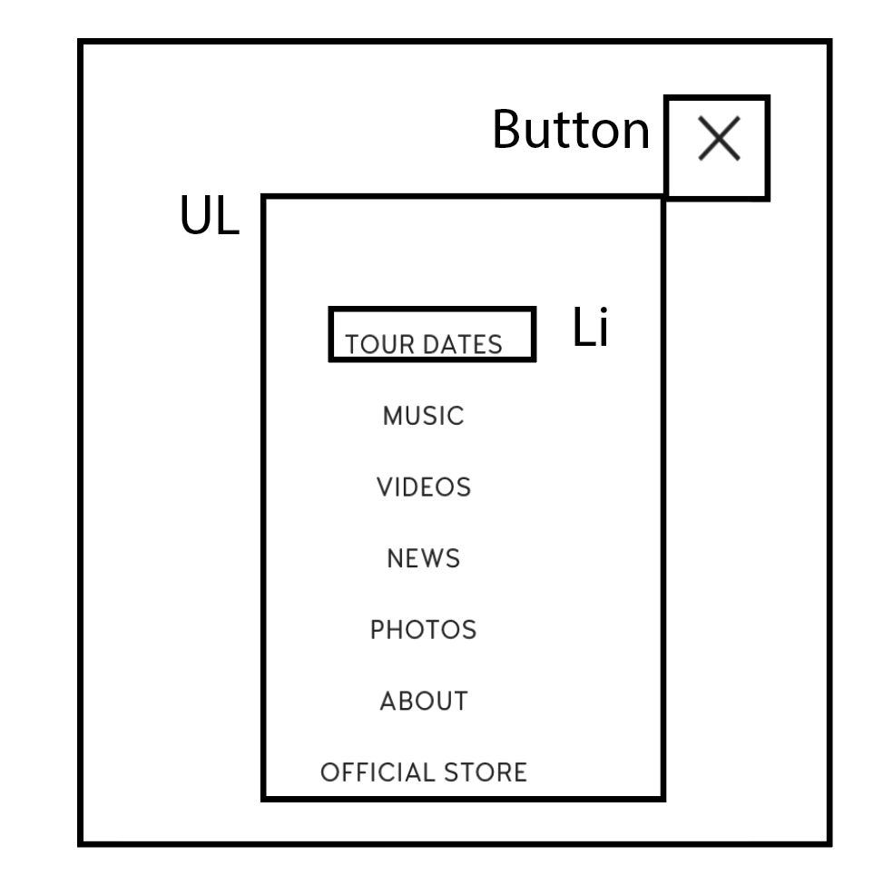
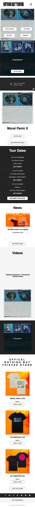
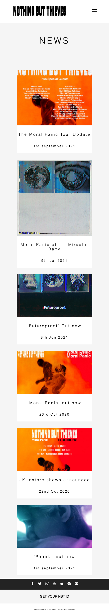

# Procesverslag
Markdown is een simpele manier om HTML te schrijven.  
Markdown cheat cheet: [Hulp bij het schrijven van Markdown](https://github.com/adam-p/markdown-here/wiki/Markdown-Cheatsheet).

Nb. De standaardstructuur en de spartaanse opmaak van de README.md zijn helemaal prima. Het gaat om de inhoud van je procesverslag. Besteedt de tijd voor pracht en praal aan je website.

Nb. Door *open* toe te voegen aan een *details* element kun je deze standaard open zetten. Fijn om dat steeds voor de relevante stuk(ken) te doen.

## Jij

uitwerken voor kick-off werkgroep

### Auteur:
Nienke de Keijzer

#### Je startniveau:
Blauw

#### Je focus:
Responsive
 

## Je website

uitwerken voor kick-off werkgroep

### Je opdracht:
https://www.nbthieves.com/

#### Screenshot(s) van de eerste pagina (small screen): 
hier de naam van de pagina  

#### Screenshot(s) van de tweede pagina (small screen):
hier de naam van de pagina  

 

## Breakdownschets (week 1)

uitwerken na afloop 2e werkgroep

### de hele pagina: 

### dynamisch deel (bijv menu): 

## Voortgang 1 (week 2)

uitwerken voor 1e voortgang

### Stand van zaken
Het was moeilijk om weer even in te komen, maar het is allemaal goedgekomen. Begonnen met de complete HTML schrijven. Om vervolgens door de chaos heen alles te redden met CSS. 1 section per keer aan het opmaken om orde te bewaren

### Agenda voor meeting
samen met je groepje opstellen
X

### Verslag van meeting
hier na afloop snel de uitkomsten van de meeting vastleggen

- Het is belangrijk dat ik in mijn HTML/CSS meer comments toevoeg voor duidelijkheid en leesbaarheid van de code

## Voortgang 2 (week 3)

uitwerken voor 2e voortgang

### Stand van zaken
Druk bezig met CSS opmaak. HTML is al helemaal af. Af en toe kleine veranderingen m.b.t. de opmaak of veranderingen van de layout. Nog niet begonnen aan JS, wel plannen gemaakt met wat er moet gebeuren. Ook begonnen met mediaqueries te gebruiken. Mijn website is dan nu ook responsive! het was best een uitdaging en puzzelen om vervolgens de layout weer op zn plek te krijgen

### Agenda voor meeting
samen met je groepje opstellen
X

### Verslag van meeting
hier na afloop snel de uitkomsten van de meeting vastleggen

- !important is verboden! Probeer een andere manier te vinden (zie link robert - bron 4)
- Probeer de header nog even verder mooi te maken

## Toegankelijkheidstest (week 4)

uitwerken na test in 8e voortgang

### Bevindingen
Lijst met je bevindingen die in de test naar voren kwamen:

#### Bril - Glare
Mensen met een 'glare' zien veel waziger en slechter dan normale mensen met alleen een bril op sterkte

Het lettertype was erg moeilijk te lezen. En dan heb ik het over de dunne teksten. Deze stonden op font-weight: 100;. Om de tekst beter leesbaar te maken heb ik deze veranderd naar 300 tot 500. Zo behoud ik de stijl van de website, maar is deze wel beter leesbaar

#### Bril - Kleurenblind (oranje/geel) 
Er zijn verschillende soorten kleurenblindheid. Deze bril was gefocussed op (denk ik) een protanoop. Hierbij werken de rode 'kegeltjes' niet. 

Tijdens de test was mijn website erg makkelijk te zien. Ik heb niet zo gevoelige contrasten in mijn website voor protanopen. Op de kleuren van de afbeeldingen na. Hier kan ik alleen niks aan veranderen. De problemen die er waren, zijn eigenlijk alleen gericht op de achtergrondkleuren van de afbeelding. Verder was de website gewoon toegankelijk

#### Bril - Hemifield loss
Dit betekend dat je de helft van het zicht niet werkt. Je ziet een kant gewoon niet. Beide ogen werken wel, maar wel voor de helft

Met de bril op was mijn website gemakkelijk te gebruiken. Je had wel zicht problemen als je naar links keek. Helaas is daar niet tegenop te coderen. De gebruiker met deze ziekte zal er omheen moeten kijken en zich aan moeten passen aan de situatie

#### Voiceover - blinden met screenreader 
Een screenreader wordt gebruikt door blinden/slechtzienden. Een software leest de code en alle tekst hardop op voor de gebruiker als deze (automatisch) door de website heen navigeert

De website en de code was erg goed te lezen. Er waren geen problemen gevonden met fout gebruikte tags. Elke link werkte en kon geactiveerd/bezocht worden. De afbeeldingen waren goed en duidelijk beschreven met een alt tekst

#### Beperking in beweging - Vastgebonden vingers 
Mensen die hun motoriek niet goed op orde hebben, kunnen soms wat moeilijker door een website navigeren. Mensen die met hun vingers in het gips zitten of mensen die minder dan 5 vingers op 1 hand hebben. 

De echte uitdaging was het scrollen over de website. Ik moest mijn hand anders positioneren om via mijn touchpad te kunnen scrollen. Ook het zoomen op de website ging wat moeilijk. Dit komt natuurlijk omdat je niet alle vingers goed kan gebruiken. Verder kon er wel makkelijk gedrukt worden op de knoppen

## Voortgang 3 (week 4)

uitwerken voor 3e voortgang

### Stand van zaken
Veel in detail de CSS gaan uitwerken en een beginsel gemaakt aan JS. Het hamburgermenu is af!! Nog de laatste dingetjes en details aan het uitwerken en dan zijn we wel klaar? Ik zit er nog aan te denken om nog een poging te doen tot een JS slider van de bovenste 2 elementen. Al is dit nog best een uitdaging
Ook nog even mn code netter gemaakt. Alle PX omgezet naar EM of %. (zie bron 5) De OL's naar UL's omgetoverd en mijn classes/id's netter vernoemd :)

### Agenda voor meeting
samen met je groepje opstellen
X

### Verslag van meeting
hier na afloop snel de uitkomsten van de meeting vastleggen

- ID's weghalen. Probeer meer met nth te kijken 
Bovenstaand met Robert besproken: Is in deze use case niet nodig. Stel ik ga later een grotere website maken en meerdere articles gebruiken die dezelfde styling hebben, is het niet handig. *want een ID mag je maar 1x gebruiken* √
- Zet bij elk divje wat het is en waarom het er staat √
- Bepaalde class/id namen meer uitschrijven voor duidelijkheid 
- articles/sections omdraaien √
Bovenstaand met robert besproken. Is een beetje eigen inbreng. Zie bron 6 voor raadpleging

## Eindgesprek (week 5)

<detailsx>

uitwerken voor eindgesprek

### Stand van zaken
In het begin ging het super goed. De basis neerleggen qua html en css was zo gedaan en ik had in 3 dagen al een soorrt van website staan. Nog niet alles tot in de puntjes uitgewerkt maar dat maakt niet uit. Daarna met de preciezere opmaak ging het soms wat stroever. Maar door veel google te gebruiken en andere mensen om hulp te vragen, heb ik het allemaal op kunnen lossen. 
Naarmate de laatste werkgroepen kwamen, had ik wel iets meer moeite om er nog aan te gaan zitten werken. Ik was alleen maar bezig met dezelfde probleempjes en het lukte me niet om ze op te lossen. Uiteindelijk heb ik nog gekozen om echt bij responsive te blijven. Javascript is erg leuk als het werkt, maar ik had meer behoefte aan die responsiveness. Hadden we meer tijd gehad en meer over javascript dingetjes geleerd, dan had ik nog wel een aantal dingetjes toe willen voegen. 
Uiteindelijk heb ik nog met javascript een geanimeerd burgermenu gemaakt! Hier ben ik stiekem nog het meest trots op, omdat in het uitleg filmpje een andere manier werd gebruikt om de code te schrijven. Vervolgens heb ik heel goed gekeken wat alles nou betekende en er mijn eigen code uit kunnen halen. En het werkt gewoon!

### Screenshot(s)

## Bronnenlijst

continu bijhouden terwijl je werkt

Nb. Wees specifiek ('css-tricks' als bron is bijv. niet specifiek genoeg).

1. <a href='https://www.youtube.com/watch?v=gXkqy0b4M5g'>Responsive nav burger menu</a>
2. <a href='https://css-tricks.com/snippets/css/a-guide-to-flexbox/'>CSS-tricks - flexbox</a>
3. <a href='https://css-tricks.com/snippets/css/complete-guide-grid/'>CSS-tricks - Grid</a>
4. <a href='https://developer.mozilla.org/en-US/docs/Web/CSS/Specificity'>MDN Web Docs - Specificity</a>
5. <a href='https://www.w3schools.com/tags/ref_pxtoemconversion.asp'>W3S - PX to EM</a>
6. <a href='http://html5doctor.com/'>HTML5 Doctor</a>

