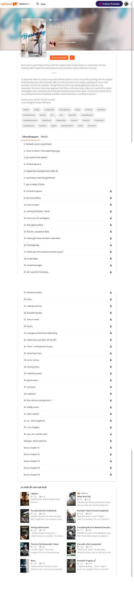

# Procesverslag
**Auteur:** -Nienke de Keijzer-

Markdown cheat cheet: [Hulp bij het schrijven van Markdown](https://github.com/adam-p/markdown-here/wiki/Markdown-Cheatsheet). Nb. de standaardstructuur en de spartaanse opmaak zijn helemaal prima. Het gaat om de inhoud van je procesverslag. Besteedt de tijd voor pracht en praal aan je website.

## Bronnenlijst
1. https://css-tricks.com/
2. -bron 2-
3. -...-

## Eindgesprek (week 7/8)

-dit ging goed & dit was lastig-

**Screenshot(s):**

-screenshot(s) van je eindresultaat-

## Voortgang 3 (week 6)

-same as voortgang 1-

## Voortgang 2 (week 5)

-same as voortgang 1-

## Voortgang 1 (week 3)

### Stand van zaken

Flexbox maakt me oprecht agressief. En alles wat met positioneren te maken heeft ook. Ik doe oprecht me best, maar dit alles test mijn geduld wel. Het lukt enigzins. Het is een behoorlijke uitdaging om niet teveel classes te gebruiken maar veel die nth te gebruiken. Als het team van CSS tricks kon zien hoe vaak en waarvoor ik op hun website zit, zullen ze ondertussen wedjes hebben lopen met wat ik nu weer opzoek of voor de hoeveelste keer alweer hetzelfde. Het is leuk als het lukt, maar het mag wat sneller lukken... Ondertussen ziet mijn website er niet uit op mobiel maar is web best okay..?

**Screenshot(s):**

Zoals ik al zei: het is niet best, maar het is iets. Loop erg te strugglen met flexbox en positioneren, en dat zie je hier erg snel terug komen. Bij lange na niet tevreden cover

Ja. Dit is gewoon heel hard huilen en uitstellen. Heb hier niet veel over te zeggen

### Agenda voor meeting

-samen met je groepje opstellen-

| Nienke         | Kai                | Lisa         | Jeroen           |
| ---            | ---                | ---          | ---              |
| overallook     | en dit             | en ik dit    | en dan ik dat    |
| semantiek      | dit als er tijd is | nog een punt | dit wil ik zeker |
| beste aanpak   | ...                | ...          | ...              |

### Verslag van meeting

-na afloop snel uitkomsten vastleggen-

## Breakdownschets (week 1)

## Intake (week 1)
-uitwerken voor de kick-off werkgroep - begin van de eerste week-

**Je startniveau:** Blauw

**Je focus:** Resurface

**Je opdracht:** www.wattpad.com/home

**Screenshot(s) van de eerste pagina (small screen):**

**Screenshot(s) van de tweede pagina (small screen):**

